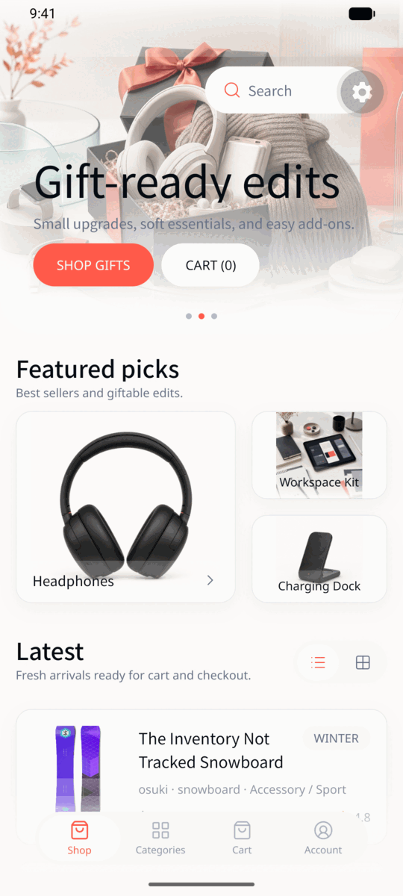
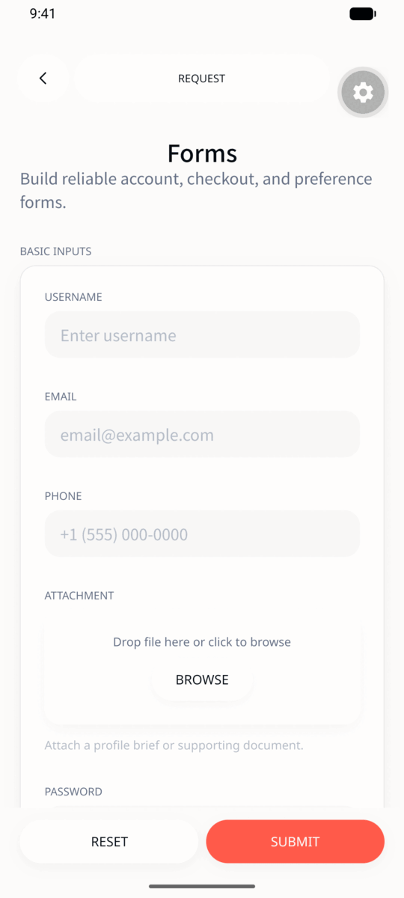
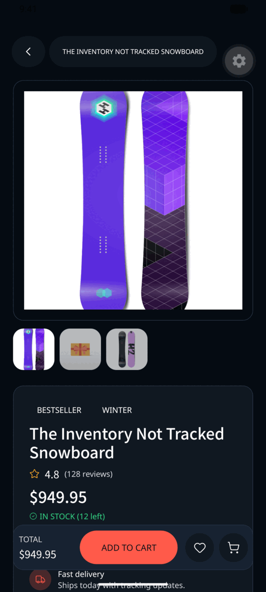
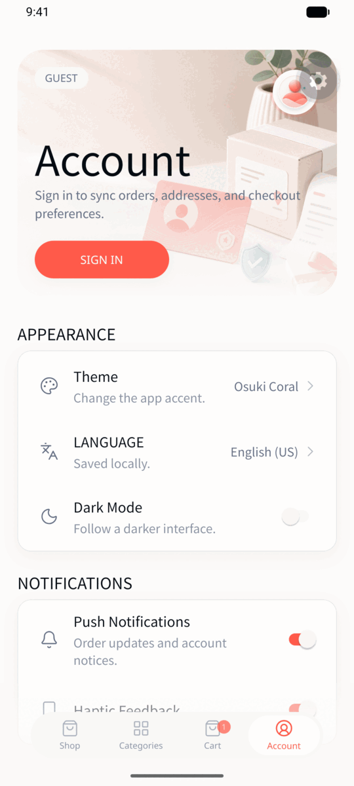
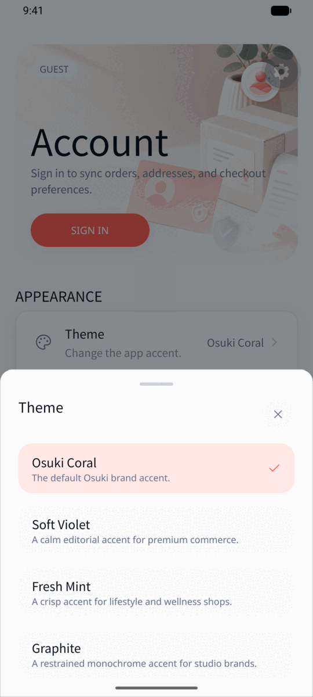
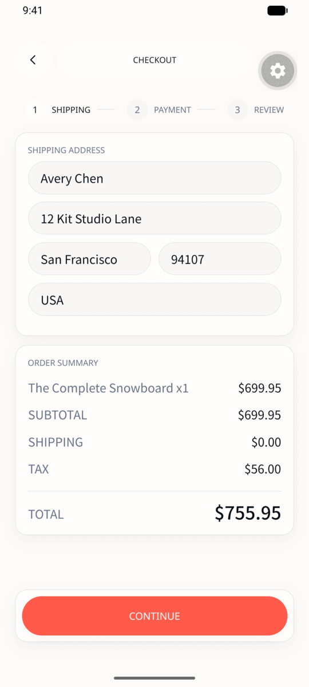

# Osuki Kit

React Native and Expo UI, built for products that are read as much as they are
tapped — dense screens, long lists, CJK text beside Latin text.

Plain React Native styles, semantic theme tokens, and dark mode treated with the
same care as light. No utility classes, no `className`, no runtime style engine.
What a component looks like is decided by the theme; what it does is decided by
its props.

|                                       |                                        |                                                       |
| :-----------------------------------: | :------------------------------------: | :---------------------------------------------------: |
|          |         |  |
|          Commerce templates           |            Form primitives             |                The same screens, dark                 |
|  |  |                  |
|        Config-driven settings         |        Swappable theme presets         |                  Multi-step checkout                  |

Screens from `apps/native`, running on the Expo showcase app in this repository.

## Packages

| Package                                              | What it is                                                                                                                               |
| ---------------------------------------------------- | ---------------------------------------------------------------------------------------------------------------------------------------- |
| [`@osuki-dev/ui`](packages/ui)                       | 65 primitives and the theme: `Text`, `Button`, `Input`, `Select`, `Sheet`, `Dialog`, `Tabs`, `ListItem`, `Screen`, `EmptyState`, `Toast` |
| [`@osuki-dev/kit-community`](packages/kit-community) | ~30 whole screens driven by config objects: auth, settings, dashboard, list/detail/form, commerce, content                               |

Reach for a `kit-community` screen when the screen is a shape the kit already
knows, and drop to `@osuki-dev/ui` when it is not.

```sh
npx expo install @osuki-dev/ui @osuki-dev/kit-community
```

Both packages are MIT, released together on the same version, and have twelve
peer dependencies rather than bundling anything —
[getting-started.md](packages/ui/docs/getting-started.md) has the table.

## Support matrix

| `@osuki-dev/ui` | Expo SDK | React Native | React |
| --------------- | -------- | ------------ | ----- |
| 0.2.x           | 57       | 0.86         | 19.2  |

Each release targets one Expo SDK. When a new SDK ships, a compatible release
follows; older SDKs are not backported.

`0.x` is not API-stable. A minor version may contain breaking changes, and
renaming a semantic or component token counts as one — consumers key their theme
overrides on those names.

## Documentation

The docs ship **inside the npm package**, at
`node_modules/@osuki-dev/ui/docs/`, so they can never drift from the version you
installed and an agent can read them offline. In this repository they live in
[`packages/ui/docs/`](packages/ui/docs):

| You are…                         | Read                                                      |
| -------------------------------- | --------------------------------------------------------- |
| setting up a new app             | [getting-started.md](packages/ui/docs/getting-started.md) |
| choosing a component             | [components.md](packages/ui/docs/components.md)           |
| theming, dark mode, brand colour | [theme.md](packages/ui/docs/theme.md)                     |
| assembling a whole screen        | [patterns.md](packages/ui/docs/patterns.md)               |
| reviewing a diff                 | [conventions.md](packages/ui/docs/conventions.md)         |

### For coding agents

[`.agents/skills/osuki-kit/SKILL.md`](.agents/skills/osuki-kit/SKILL.md) is a
skill an agent can load before writing UI with these packages. It states the
rules that produce a broken screen rather than an ugly one, points at the right
doc for the task, and lists what to check before calling a screen done. Copy it
into your own project's skills directory, or point your agent at the path.

For changing the packages themselves rather than consuming them, there is
[`osuki-ui-architecture`](.agents/skills/osuki-ui-architecture/SKILL.md).

## Theme

Mount one provider:

```tsx
import { ThemeProvider } from "@osuki-dev/ui";

export function Root() {
	return (
		<ThemeProvider>
			<App />
		</ThemeProvider>
	);
}
```

Override only the tokens you care about:

```tsx
<ThemeProvider
	theme={{
		colors: { primary: "#FF5A4A", background: "#FCFBFA" },
		components: { Button: { radius: "pill" } },
	}}
>
	<App />
</ThemeProvider>
```

Tokens are semantic, not literal: `background`, `surface`, `surfaceRaised`,
`border`, `text`, `textMuted`, `primary`, `danger`, `success`, `warning`,
`info`. Read them with the narrowest hook that works —
`useThemeTokens()` for anything that only reads values, `useThemeMode()` only
for controls that change light/dark.

## Testing

Components forward `testID`, and config-driven screens derive stable ids when
you omit one:

```tsx
<Button testID="save-profile">SAVE</Button>
<FormField config={{ key: "email", label: "Email", type: "email" }} />
// the field's testID is form-field-email
```

A settings item with `id: "dark-mode"` inside a section with `id: "appearance"`
becomes `settings-item-appearance-dark-mode`.

## The showcase app

`apps/native` is a real Expo Router app covering every primitive and template —
it is where the screenshots above come from.

```sh
bun install
bun run dev:native
```

To build and launch on a booted simulator or emulator:

```sh
cd apps/native
bun run ios       # or: bun run android
```

`ios/` and `android/` are generated, not committed. Every native setting that
must survive regeneration lives in `apps/native/app.json` — bundle identifiers,
icons, splash screen, iOS privacy manifest, config plugins. Editing the
generated projects directly is not durable: the next `expo prebuild` discards
it.

The app reads from a local SQLite adapter by default. The commerce screens can
also read a Shopify storefront; the committed default points at a public demo
store, and `EXPO_PUBLIC_SHOPIFY_STOREFRONT_DOMAIN` /
`EXPO_PUBLIC_SHOPIFY_STOREFRONT_ACCESS_TOKEN` point it at your own.

### End-to-end coverage

```sh
cd apps/native
bun run e2e:generate
bun run e2e:ios       # or: bun run e2e:android
```

Flows are generated one per page, plus a `/component-e2e` route that exercises
every exported primitive, and executed by
[`agent-device`](https://www.npmjs.com/package/agent-device). The coverage
report is written to `apps/native/e2e/generated/COVERAGE.md`.

## Development

```sh
bun run check                  # lint, format, types, tests
bun run check:docs-coverage    # every exported component is documented
bun run smoke:public-packages  # both packages pack and install cleanly
```

`check:docs-coverage` is not optional politeness: adding an export without
documenting it fails the build.

## Contributing

Read [CONTRIBUTING.md](CONTRIBUTING.md) first — it states up front which changes
are accepted, so a rejection is never a surprise. Bug fixes, accessibility
fixes, platform differences, and documentation are welcome as PRs. New
components are decided by [the roadmap](docs/ui/roadmap.md).

- [Code of Conduct](CODE_OF_CONDUCT.md)
- [Security policy](SECURITY.md) — never report a vulnerability in a public issue
- [Component quality bar](docs/ui/component-quality-bar.md)

## License

MIT © Osuki

The MIT License covers code only. The Osuki name, logo, and brand assets are not
included — see [NOTICE](NOTICE).
